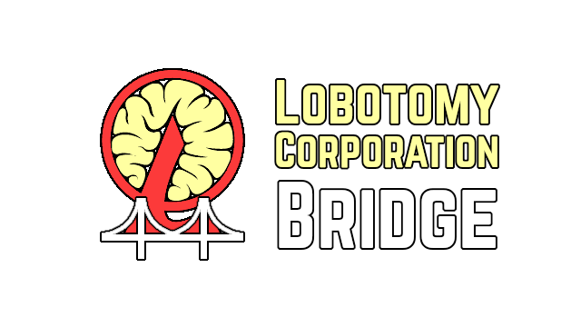

# Lobotomy Bridge Mod

A mod for the game Lobotomy Corporation that enables realtime control and data exchange with the game via WebSockets.

Any WebSocket client in any programming language should work, but a [TypeScript/JavaScript client library](https://github.com/Hawkbat/lobotomy-corp-bridge/) is available and kept in sync with updates to this server mod.

## License

This project is licensed under the MIT License.

## Contributing

If you find any issues or have suggestions for improvements, please open an issue or submit a pull request on [GitHub](https://github.com/Hawkbat/LobotomyBridgeMod).

## Author

Hawkbar

## Links

- [Homepage](https://github.com/Hawkbat/LobotomyBridgeMod)
- [Issues](https://github.com/Hawkbat/LobotomyBridgeMod/issues)
